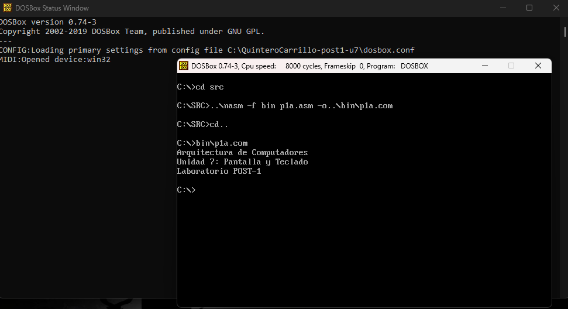
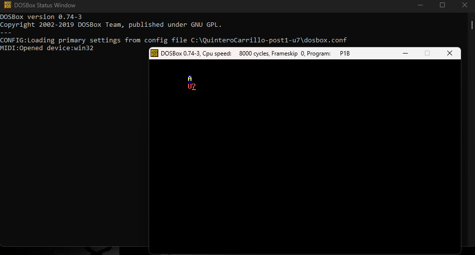
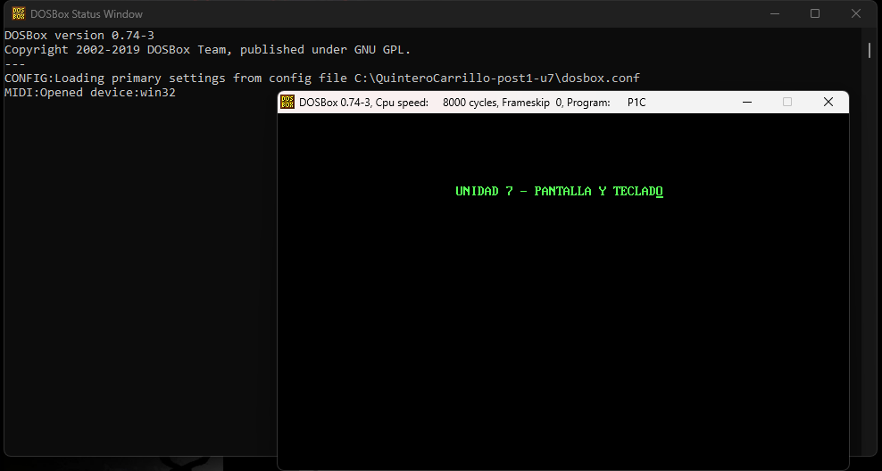

# Laboratorio 7 — Manejo de Pantalla y Teclado (INT 21h e INT 10h)

**Estudiante:** Neidys Mariana Quintero Carrillo
**Código:** 1152447  
**Curso:** Arquitectura de Computadores  
**Programa:** Ingeniería de Sistemas  
**Universidad:** Francisco de Paula Santander  
**Año:** 2026  

---

## Descripción del laboratorio

Este laboratorio implementa tres programas en lenguaje ensamblador x86 que
utilizan las interrupciones INT 21h e INT 10h para gestionar la salida de texto
en pantalla, controlar la posición del cursor y aplicar atributos de color en
modo texto, ejecutando el laboratorio en DOSBox con NASM como ensamblador.

---

## Entorno utilizado

| Componente | Versión / Detalle |
|---|---|
| Sistema operativo anfitrión | Windows [10/11] |
| DOSBox | 0.74-3 |
| NASM para DOS | 2.07 (Jul 19 2009) |
| CWSDPMI | csdpmi5b |
| Editor de texto | Notepad++ |

---

## Estructura del repositorio

```

QuinteroCarrillo-post1-u7/
├── src/
│   ├── p1a.asm    # Programa 1: salida de texto con INT 21h
│   ├── p1b.asm    # Programa 2: cursor y color con INT 10h
│   └── p1c.asm    # Programa 3: cadena en posicion exacta con color
├── bin/
│   ├── p1a.com    # Ejecutable programa 1
│   ├── p1b.com    # Ejecutable programa 2
│   └── p1c.com    # Ejecutable programa 3
├── capturas/
│   ├── cp1_p1a.png    # Checkpoint 1: salida de tres lineas
│   ├── cp2_p1b.png    # Checkpoint 2: A amarillo y U7 rojo con color
│   └── cp3_p1c.png    # Checkpoint 3: titulo verde en fila 5
├── dosbox.conf    # Configuracion DOSBox
└── README.md      # Este archivo
```
---

## Tabla de funciones INT 21h utilizadas

| Función (AH) | Descripción | Parámetros |
|---|---|---|
| 09h | Imprimir cadena | DS:DX → cadena terminada en "$" |
| 07h | Leer carácter sin eco | Retorna carácter en AL |
| 4Ch | Terminar proceso | AL = código de retorno |

---

## Tabla de funciones INT 10h utilizadas

| Función (AH) | Descripción | Registros |
|---|---|---|
| 06h | Limpiar pantalla (scroll) | AL=0, CX=0, DX=184Fh, BH=atributo |
| 02h | Posicionar cursor | BH=página, DH=fila, DL=columna |
| 09h | Escribir carácter con atributo | AL=carácter, BL=atributo, CX=repeticiones |

---

## Descripción de cada programa

### Programa 1 — p1a.asm: Salida de texto con INT 21h
Imprime tres cadenas de texto en pantalla usando INT 21h función 09h.
Cada cadena termina con el carácter "$" y contiene los bytes 0Dh 0Ah
para el salto de línea. El programa termina con INT 21h función 4Ch.

### Programa 2 — p1b.asm: Cursor y color con INT 10h
Limpia la pantalla usando INT 10h función 06h con AL=0. Posiciona el
cursor en coordenadas específicas con función 02h y escribe caracteres
con atributos de color usando función 09h. El atributo 1Eh corresponde
a fondo azul (1h) con texto amarillo (Eh), y 0Ch a texto rojo claro sobre
fondo negro.

### Programa 3 — p1c.asm: Cadena en posición exacta con color
Recorre la cadena carácter por carácter usando SI como puntero. Para
cada carácter posiciona el cursor con INT 10h/02h y lo escribe con
atributo 0Ah (verde brillante sobre negro) usando INT 10h/09h.
El bucle termina al encontrar el carácter "$".

---

## Tabla de atributos de color usados

| Atributo | Binario | Fondo | Texto | Usado en |
|---|---|---|---|---|
| 07h | 0000 0111 | Negro | Blanco gris | Limpiar pantalla |
| 1Eh | 0001 1110 | Azul | Amarillo | Letra "A" en p1b |
| 0Ch | 0000 1100 | Negro | Rojo claro | Letras "U7" en p1b |
| 0Ah | 0000 1010 | Negro | Verde brillante | Título en p1c |

---

## Capturas del proceso

### Checkpoint 1 — Salida de texto con INT 21h


### Checkpoint 2 — Cursor y color con INT 10h


### Checkpoint 3 — Cadena en posición exacta con color verde


---

## Resultados obtenidos

| Checkpoint | Programa | Resultado esperado | 
|---|---|---|
| CP1 | p1a.com | Tres líneas de texto en pantalla | 
| CP2 | p1b.com | "A" amarillo/azul y "U7" rojo/negro | 
| CP3 | p1c.com | Título verde brillante en fila 5 col 25 | 

---

## Conclusiones

- La interrupción INT 21h función 09h permite imprimir cadenas completas
  de forma sencilla cargando la dirección en DS:DX, siendo la forma más
  directa de mostrar texto en DOS.
- La interrupción INT 10h ofrece control preciso sobre la posición del cursor
  y los atributos de color, permitiendo crear interfaces de texto con colores
  distintos para cada elemento visual.
- El byte de atributo de video se divide en 4 bits de fondo y 4 bits de texto,
  lo que permite 16 colores de texto y 8 de fondo en modo texto estándar.
- El control carácter por carácter con INT 10h/02h y 09h permite colocar
  texto en cualquier posición exacta de la pantalla de 80×25 caracteres.
